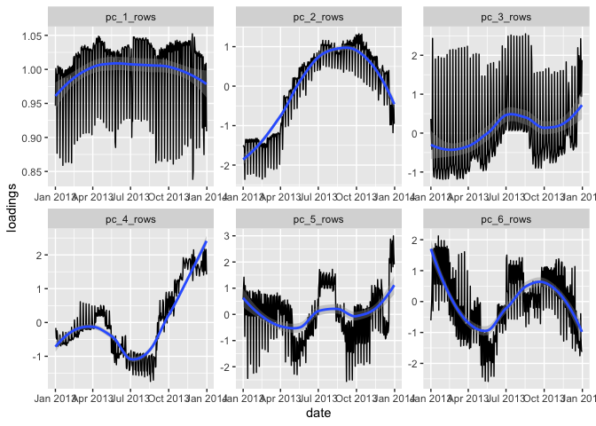
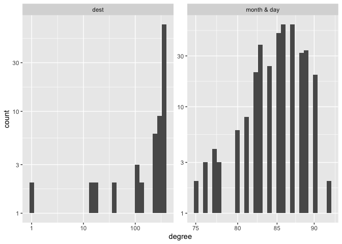
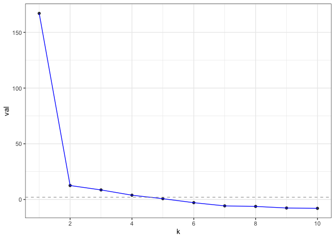
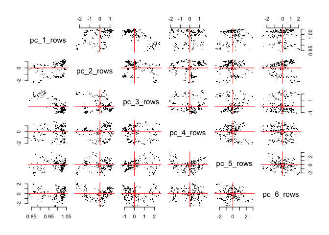

PCA for the people
================
Karl Rohe
2024-01-03

The current approach to PCA (principal components analysis) is *matrix
first*. This note begins to explore an alternative path, one that is
*model first*. This is code proposes an alternative way to think about
PCA that makes matrices transparent; completely hidden, unless you want
to see the code.

I hope this makes PCA legible for folks that have not yet learned linear
algebra (just like linear models are legible without solving linear
systems of equations).

I am personally inspired by this approach because (despite the fact that
I love matrices and linear algebra) I find that this *model first* way
of thinking is so much easier and more direct.

This document gives an illustration with a data analysis of the popular
`nycflights13` data via PCA. Headline: we find two seasonal effects
(annual and weekly) and also the “fly-over-zone” (midwest 4ever. ride or
die \<3 much love to my midwest fam). Code details follow this analysis.

(Disclaimer: this is very early in this project. So, the syntax and the
code is likely to change a great deal. Input is very welcome about ways
to improve it.)

#### Install

The functions for PCA for the People are contained in an R package
`longpca`. If you do not already have `devtools` installed, you will
first need to install that:

``` r
install.packages("devtools")
devtools::install_github("karlrohe/longpca")
```

Thank you to Alex Hayes for helpful feedback in this process and
suggesting the name `longpca`.

### PCA the nycflights.

The code is fast and nimble:

``` r
library(nycflights13)
embeddings = pca_count(~ (month & day)*(dest), 
                       flights, 
                       k = 6)
```

This performs PCA. The key innovation is the “formula”:
`1 ~ (month & day)*(dest)`.

This specifies the model that we want (i.e. the matrix for PCA). In
particular, it will perform PCA on a matrix where the rows are indexed
by `(month & day)`, two variables of the `flights` data. There are 365
unique values of these. And the columns of the matrix are indexed by
destinations `dest`, another variable in `flights`. There are about 100
different destinations. There are multiple rows of `flights` with
identical values of `month & day` and `dest` (e.g. lots of flights from
LGA -\> LAX every day). So, the values of the matrix are a sum over the
variable on the left side of the formula. Here, the variable is just
`1`… so, the matrix counts the number of flights to that destination on
that day.

The output contains the pc’s and their loadings in a tidy format:

``` r
embeddings$row_features %>% sample_n(size = 3)
```

    ## # A tibble: 3 × 11
    ##   month   day row_id degree weighted_degree pc_1_rows pc_2_rows pc_3_rows
    ##   <int> <int>  <int>  <int>           <dbl>     <dbl>     <dbl>     <dbl>
    ## 1     6    14    257     89             989      1.03     0.702   -0.113 
    ## 2     8    12    316     86            1001      1.04     0.946   -0.0395
    ## 3     4     4    186     87             985      1.03    -0.988    0.925 
    ## # ℹ 3 more variables: pc_4_rows <dbl>, pc_5_rows <dbl>, pc_6_rows <dbl>

``` r
embeddings$column_features %>% sample_n(size = 3)
```

    ## # A tibble: 3 × 10
    ##   dest  col_id degree weighted_degree pc_1_columns pc_2_columns pc_3_columns
    ##   <chr>  <int>  <int>           <dbl>        <dbl>        <dbl>        <dbl>
    ## 1 ROC       31    365            2416        0.868       -0.192       -0.524
    ## 2 EGE       53    110             213        0.178       -3.63         0.610
    ## 3 SRQ       33    365            1211        0.615       -0.740       -0.383
    ## # ℹ 3 more variables: pc_4_columns <dbl>, pc_5_columns <dbl>,
    ## #   pc_6_columns <dbl>

Because they are tidy, it makes them pretty easy to ggplot.

First, let’s do the rows (i.e. dates). To interpret pc’s, it is best to
plot it with contextual information and/or in the *native space*. For
dates, the native space is a time series or a sequence. Let’s plot it
there. I give my interpretation after the plots.

``` r
embeddings = pca_count(1 ~ (month & day)*(dest), flights, k = 6)

embeddings$row_features %>% 
  mutate(date = make_date(day = day, month=month, year = 2013)) %>% 
  select(date, contains("pc_")) %>% 
  pivot_longer(contains("pc_"), names_to = "pc_dimension", values_to = "loadings") %>% 
  ggplot(aes(x = date, y = loadings)) + geom_line() + 
  facet_wrap(~pc_dimension, scales= "free") + geom_smooth()
```

    ## `geom_smooth()` using method = 'loess' and formula = 'y ~ x'

<!-- -->

I always think of the first pc as the “mean”. What we see is that
flights are more or less constant throughout the year (see y-axis). I
presume that the oscillations are for the weekends. `pc_1` says that,
across destinations, there are more flights during the work week and
fewer flights on the weekends. The second pc gives a seasonal effect
(fewer flights in winter, more in summer); importantly, after `pc_1`,
some destinations will have negative values of this (i.e. more in the
winter, fewer in the summer). The third pc is positive on weekend
destinations (more flights on the weekends and fewer during the weekdays
relative to `pc_1`). Again, like `pc_2` some destinations will have a
negative value (i.e. more flights on the weekends and fewer during the
weekdays relative to the previous two pc’s). The last three are harder
to interpret. My uninformed guess is that it is some artifact of airline
decisions. If you have a guess, I’d love to hear it. Also, later on with
`pick_dim`, we have some evidence that they are noise.

Now, let’s do the columns (i.e. destinations). The “native space” for
destinations is a map. Let’s plot it there. Be sure you have `maps`
installed.

``` r
airports %>% sample_n(size = 3)
```

    ## # A tibble: 3 × 8
    ##   faa   name              lat   lon   alt    tz dst   tzone           
    ##   <chr> <chr>           <dbl> <dbl> <dbl> <dbl> <chr> <chr>           
    ## 1 DRI   Beauregard Rgnl  30.8 -93.3   202    -6 A     America/Chicago 
    ## 2 OAJ   Albert J Ellis   34.8 -77.6    94    -5 A     America/New_York
    ## 3 MGE   Dobbins Arb      33.9 -84.5  1068    -5 A     America/New_York

``` r
# first, get the lat and lon for the airports:
airport_dat = embeddings$column_features %>% 
  left_join(airports %>% select(dest=faa, lat,lon)) %>% 
  select(lat, lon, contains("_col")) %>% 
  pivot_longer(contains("pc_"),
               names_to = "pc_dimension", values_to = "loadings") %>% 
  drop_na()
```

    ## Joining with `by = join_by(dest)`

``` r
library(maps)
usa_map <- map_data("state")
p <- ggplot() + 
  geom_polygon(data = usa_map, aes(x = long, y = lat, group = group), 
               fill = "white", color = "black") +
  coord_fixed(1.3, xlim = c(-125, -65), ylim = c(25, 50)) 
# i'm only keeping lower 48 states, dropping Anchorage and Honolulu.


p + geom_point(data = airport_dat, aes(x = lon, y = lat, 
                                       size = abs(loadings), color = loadings)) +
  facet_wrap(~ pc_dimension)  +
  scale_color_gradient2(low = "red", high = "blue", mid = "white")
```

<!-- -->

Here `pc_1` should align with larger and smaller airports (bigger
airports \<-\> more flights throughout the year). `pc_2` is negative on
Denver and Florida and positive in Maine. Looking back at the time
series plots, I interpret this to mean that people go to Denver (skiing)
and Florida (beach) in the winter and Maine (coastline) in the summer.
`pc_3` picks up the “fly-over zone”… looking back at the time series,
folks prefer to travel here during the work week. So, the blue areas are
more weekend (vacation) destinations and the red areas are the fly-over.
The other pc’s are difficult for me to interpret (my guess is that they
are weird artifacts of airline things… noise). We do see that the last
three are heavily localized on a few airports, looking back at the pairs
plots you can see this localization. Given that, my sense is that they
are not so interesting, but if I needed to make sense of them, I would
print out their most extreme elements and dig into those airports.
Making this function is a todo item.

So, using the code is easy. You just need to specify a formula. It’s fun
to think of other combinations and easy to try them out.

There are three functions that you might like `diagnose`, `pick_dim`,
and `plot` that are explained below.

# A deeper look inside the code.

To illustrate the code, consider the popular data example `nycflights13`
which contains a row for every flight departing from the 3 main New York
City airports during 2013 (LGA, JFK, and EWR). It includes things like
date, destination, and information about delays.

``` r
library(nycflights13)
flights
```

    ## # A tibble: 336,776 × 19
    ##     year month   day dep_time sched_dep_time dep_delay arr_time sched_arr_time
    ##    <int> <int> <int>    <int>          <int>     <dbl>    <int>          <int>
    ##  1  2013     1     1      517            515         2      830            819
    ##  2  2013     1     1      533            529         4      850            830
    ##  3  2013     1     1      542            540         2      923            850
    ##  4  2013     1     1      544            545        -1     1004           1022
    ##  5  2013     1     1      554            600        -6      812            837
    ##  6  2013     1     1      554            558        -4      740            728
    ##  7  2013     1     1      555            600        -5      913            854
    ##  8  2013     1     1      557            600        -3      709            723
    ##  9  2013     1     1      557            600        -3      838            846
    ## 10  2013     1     1      558            600        -2      753            745
    ## # ℹ 336,766 more rows
    ## # ℹ 11 more variables: arr_delay <dbl>, carrier <chr>, flight <int>,
    ## #   tailnum <chr>, origin <chr>, dest <chr>, air_time <dbl>, distance <dbl>,
    ## #   hour <dbl>, minute <dbl>, time_hour <dttm>

There are so many matrices “inside” of this data, but you don’t think of
them when you see this data. Many applications are like this. The data
does not look like matrix. Instead, it looks like a spreadsheet or a SQL
database or a tibble. That is how the users think about their data. *And
underneath it*, there are so many possible matrices.

## A formula to make the matrix transparent

For example, in the flights example, you could make a matrix where every
row is a day of the year and every column is a destination airport. Each
element of the matrix is the number of flights to that destination on
that day. To do that, we propose using a formula, like in `lm`.

``` r
formula = 1 ~ (month & day)*(dest)
```

This formula and the flights data will make a sparse matrix. The
left-hand side is `1` to denote we are just going to count the
occurrences over the 336,776 rows of `flights`. If there was another
column (e.g. `size`) for which it was sensible to sum multiple values
(e.g. number of people on the flight, or number of gallons of fuel
consumed), then you could do that with `size ~ (month & day)*(dest)`. On
the right hand side, there is an “interaction” in the parlance of linear
models and the notation of `lm`. The first terms in the interaction will
index the rows of a matrix. Here, there are two columns of `flights`, in
particular `month & day`. There are 365 unique combinations of these
values. Each will be a row. The second term in the interaction does the
same thing, but those terms will become the columns.

All suggestions welcome for the formula syntax. Maybe it should also
allow `(month & day) ~ dest`? Maybe the ampersand `&` is confusing and
another symbol would be better? Other thoughts? Relevant footnote: the
syntax should also allow low-rank matrix completion, e.g. predicting
arrival delay: `arr_delay ~ (month & day)*(dest)`.

#### Technical detail here. You can skip to “Let’s do the analysis” without missing anything.

Hopefully, you rarely need to access the actual sparse matrix. But
perhaps it is instructive to see it anyways:

``` r
sparse_matrix_data = make_sparse_matrix_raw(formula, flights)
```

This creates a list of three elements. First, the sparse matrix of
counts `sparse_matrix_data$A`:

``` r
dim(sparse_matrix_data$A)
```

    ## [1] 365 105

``` r
sparse_matrix_data$A[1:5,1:8]
```

    ## 5 x 8 sparse Matrix of class "dgCMatrix"
    ##                            
    ## [1,] 20 31 3 40 47 39 14 39
    ## [2,] 20 31 3 51 45 41 14 43
    ## [3,] 19 32 3 49 46 40 17 41
    ## [4,] 20 32 3 48 46 40 17 42
    ## [5,] 13 33 3 35 26 38 11 39

Second and third, tibbles that give basic information about the row and
column “universes”…

``` r
sparse_matrix_data$row_universe
```

    ## # A tibble: 365 × 3
    ##    month   day row_id
    ##    <int> <int>  <int>
    ##  1     1     1      1
    ##  2     1     2      2
    ##  3     1     3      3
    ##  4     1     4      4
    ##  5     1     5      5
    ##  6     1     6      6
    ##  7     1     7      7
    ##  8     1     8      8
    ##  9     1     9      9
    ## 10     1    10     10
    ## # ℹ 355 more rows

``` r
sparse_matrix_data$column_universe
```

    ## # A tibble: 105 × 2
    ##    dest  col_id
    ##    <chr>  <int>
    ##  1 IAH        1
    ##  2 MIA        2
    ##  3 BQN        3
    ##  4 ATL        4
    ##  5 ORD        5
    ##  6 FLL        6
    ##  7 IAD        7
    ##  8 MCO        8
    ##  9 PBI        9
    ## 10 TPA       10
    ## # ℹ 95 more rows

The universes give the “row names” and “column names,” but in a tidy
format that allows for things like multiple variables `(month & day)`
indexing the rows. Right now, the code recomputes this object for
various different functions. For bigger spreadsheets, that can be slow.
Future extensions should allow the argument `sparse_matrix_data` for
more familiar users.

# Let’s do the analysis

### Examining the matrix sparsity

The code inside `pca_4_the_people.R` contains a few helper functions.
First, if lots of rows or columns have very few non-zero elements, this
can cause “localization issues”. The matrix needs to be “dense enough”
for the PCA to find good stuff. So, `diagnose` prints some simple
diagnostics and plots the “degree distribution” for the rows and
columns. Here, “degree” is the number of non-zero elements in that row
or column.

``` r
# inspect "degree distributions" with this funciton:
diagnose(formula, flights)
```

<!-- -->

    ## # A tibble: 6 × 3
    ##   measurement      dest `month & day`
    ##   <chr>           <dbl>         <dbl>
    ## 1 number_of_items   105           365
    ## 2 average_degree    297            86
    ## 3 median_degree     365            86
    ## 4 percent_le_1        2             0
    ## 5 percent_le_2        2             0
    ## 6 percent_le_3        2             0

For example, if either average degree was less than 10, then I might be
worried. `percent_le_x` gives the percent of rows/columns that have
row/col sums less than or equal to `x`. If these values are large, then
the matrix is very sparse and you might have trouble. Issues with
sparsity will likely manifest in localization; something that will be
evaluated in functions below.

### Picking k with cross-validated eigenvalues

When doing a PCA, you need to pick the number of dimensions that you
want. The way that we do this in my lab is with cross-validated
eigenvalues. It gives you a Z-score and a p-value. [Here is the arxiv
paper](https://arxiv.org/abs/2108.03336). Alex Hayes made it a proper R
package on CRAN
[gdim](https://cran.r-project.org/web/packages/gdim/gdim.pdf). For this
example, it picks `k=4`.

``` r
cv_eigs = pick_dim(formula, flights, dimMax = 10,num_bootstraps = 5) 
plot(cv_eigs)
```

<!-- -->

``` r
cv_eigs
```

    ## Estimated graph dimension:    4
    ## 
    ## Number of bootstraps:         5
    ## Edge splitting probabaility:  0.1
    ## Significance level:       0.05
    ## 
    ##  ------------ Summary of Tests ------------
    ##   k           z        pvals         padj
    ##   1 166.1385360 0.000000e+00 0.000000e+00
    ##   2  11.7516618 3.462177e-32 3.462177e-32
    ##   3   8.5639578 5.452888e-18 5.452888e-18
    ##   4   3.6748036 1.190162e-04 1.190162e-04
    ##   5  -0.2729057 6.075372e-01 6.075372e-01
    ##   6  -2.9539874 9.984315e-01 9.984315e-01
    ##   7  -5.0404237 9.999998e-01 9.999998e-01
    ##   8  -5.9030871 1.000000e+00 1.000000e+00
    ##   9  -7.8965717 1.000000e+00 1.000000e+00
    ##  10  -8.0343301 1.000000e+00 1.000000e+00

Notice that the top-line of the printout says that the estimated graph
dimension is 4. So, we will use `k=6` and see that in this example they
become harder to interpret. This is what we would expect if it was just
noise… but also, maybe they are not just noise?

### Let’s get the people some PCA

For right now, I named the function `pca_count`, because if there are
multiple rows of the data that have the same values for `(month & day)`
and also for `dest`, then the value inside the matrix is a *sum* of the
values on the left hand side of the formula. Right now, that is just
`1`. So, it *counts* how many times that entry appears. Some people call
this a cross-tab or a contingency table. When we do PCA to this matrix
of counts, some folks call that Correspondence Analysis.

``` r
embeddings = pca_count(formula, tib = flights, k = 6)
# In some settings, the verb "sum" is a more sensible than "count"... pca_sum is the identical function
# embeddings = pca_sum(formula, tib = flights, k = 6) 
```

In particular, the code takes a square root of every count. Then,
computes the normalized and regularized Laplacian `L` (using the number
of non-zero entries as the degree). Then, computes the leading `k`
singular vectors. This is all done with sparse linear algebra via the
packages `Matrix` and `irlba`.

``` r
names(embeddings)
```

    ## [1] "row_features"    "column_features" "middle_B"        "settings"

The `row_features` and `column_features` are the PC’s and loadings (I
don’t prefer those old terms). `middle_B` gives the singular values.
`settings` contains some details that are handy in later functions.

``` r
sample_n(embeddings$row_features, size = 3)
```

    ## # A tibble: 3 × 11
    ##   month   day row_id degree weighted_degree pc_1_rows pc_2_rows pc_3_rows
    ##   <int> <int>  <int>  <int>           <dbl>     <dbl>     <dbl>     <dbl>
    ## 1     9    25    360     86             976      1.03     1.16     -0.647
    ## 2    11    19     81     83             973      1.04     0.758    -0.527
    ## 3     4     1    183     86             970      1.03    -1.11     -0.946
    ## # ℹ 3 more variables: pc_4_rows <dbl>, pc_5_rows <dbl>, pc_6_rows <dbl>

``` r
sample_n(embeddings$column_features, size=3)
```

    ## # A tibble: 3 × 10
    ##   dest  col_id degree weighted_degree pc_1_columns pc_2_columns pc_3_columns
    ##   <chr>  <int>  <int>           <dbl>        <dbl>        <dbl>        <dbl>
    ## 1 SAT       74    365             686       0.464        0.0988       -0.141
    ## 2 CVG       67    365            3941       1.11         0.561        -1.77 
    ## 3 EYW       93     17              17       0.0215      -0.423         0.774
    ## # ℹ 3 more variables: pc_4_columns <dbl>, pc_5_columns <dbl>,
    ## #   pc_6_columns <dbl>

Notice that these features are in a wide and tidy form, making it easy
to `lubridate::make_date` (for `row_features`) and left-join with
airports (to get latitude and longitude) for `column_features`.

##### Diagnostic plots

You can `plot(embeddings)`. It makes these five plots, each described
after all plots are displayed.

``` r
plot(embeddings) 
```

<!-- -->

    ## Press [Enter] to continue to the next plot...

<!-- -->

    ## Press [Enter] to continue to the next plot...

    ## `geom_smooth()` using formula = 'y ~ s(x, bs = "cs")'

<!-- -->

    ## Press [Enter] to continue to the next plot...

<!-- -->

    ## Press [Enter] to continue to the next plot...

<!-- -->

These are the five plots:

1)  Screeplot: The top `k` singular values of `L`.  
2)  Better screeplot: its singular values `2:k` (because the first one
    is usually dominant and difficult to see an elbow past it).  
3)  A “localization plot” which is very similar (maybe exact?) to [this
    stuff](https://github.com/karlrohe/LocalizationDiagnostic); for each
    row (and column) compute its degree and its leverage score. Take the
    log of both. Fit a linear model `log(leverage)~log(degree)` and plot
    the residuals against `log(degree)`. If there is localization, I
    suspect that there will be a big curl on the right side.
4)  Pairs plot of `row_features`. This is the plot emphasized in the
    varimax paper. In these example plots below, we do not see very
    clear radial streaks.
5)  A pairs plot for `column_features`. In both pairs plots, if there
    are more than 1000 points, then the code samples 1000 points with
    probability proportional to their leverage scores. It will plot up
    to `k=10` dimensions. If `k` is larger, then it plots the first 5
    and the last 5.
